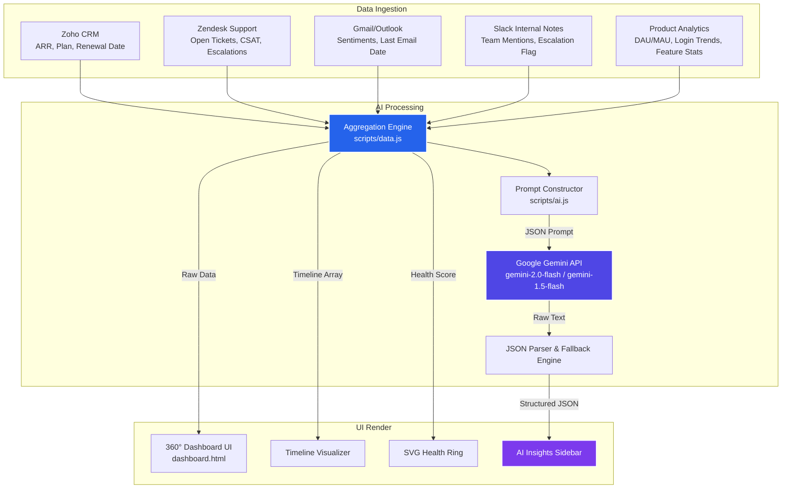

# CustomerIQ — Unified Customer Intelligence Dashboard
### Voloplay AI Tool-Building Challenge — Approach Document

*This document can be copied directly into Google Docs or exported to PDF for your submission. All images are hosted on your public GitHub repository for seamless rendering.*

---

## 1. Problem Statement

In growing businesses, customer-related data is frequently siloed across various specialized platforms used by different teams:
*   **Sales/Account Management** tracks subscription size, owners, and deal stages in CRM tools (e.g., Zoho).
*   **Customer Support** manages issues and SLAs in helpdesks (e.g., Zendesk).
*   **Customer Success & Account Managers** capture conversations and feedback via Email and internal Slack discussions.
*   **Product Operations** tracks user behavior, adoption, and logins via Product Analytics tools.

This fragmentation prevents a unified, real-time understanding of customer health, leading to:
1.  **Delayed Escalation Detection:** Support issues, negative email sentiment, and declining product usage are not automatically linked, causing high-value accounts to churn unexpectedly.
2.  **Missed Upsell Opportunities:** Growth signals, such as hitting plan limits or adopting premium features, remain buried in product databases, unexposed to Sales.
3.  **Preparation Overhead:** Account Owners and CSMs waste hours compiling customer profiles from multiple systems before every meeting.

---

## 2. Solution Approach: CustomerIQ

**CustomerIQ** is a unified, real-time customer intelligence application that consolidates customer data from 5 sources into a single, comprehensive 360° account dashboard. It leverages **Generative AI (Google Gemini API)** to automatically analyze the aggregated dataset and deliver:
*   **An Executive Summary** capturing the account's state in 2-3 sentences.
*   **Risk Signals** categorizing critical alerts by severity (HIGH/MEDIUM/LOW) and tracing them to their source systems.
*   **Opportunities** identifying expansion, retention, or advocacy plays, alongside estimated ARR values.
*   **Next Best Actions** prioritizing actions, assigning owners (e.g., CSM, Engineering, Product), setting timelines, and providing reasoning.

By using client-side data consolidation and direct API integration, CustomerIQ offers a fast, serverless prototype that is fully deployable to static hosting platforms like Vercel.

---

## 3. Architecture & Workflow

### Workflow Pipeline
The pipeline consists of three primary stages: **Ingestion**, **Context Construction**, and **AI Reasoning & Rendering**.



### Technical Workflow:
1.  **Data Fetching:** The dashboard retrieves the data structure for a selected account, consolidating records across Zoho CRM, Zendesk, Email archives, Slack notes, and Product Analytics.
2.  **Timeline Aggregation:** Chronological events (support tickets, email threads, Slack channel updates) are merged into a single timeline array sorted by date.
3.  **Prompt Composition:** The structured details of all 5 sources are fed into a prompt constructor that maps values to a dense markdown layout.
4.  **AI Inference & API Fallback:** The constructed context is sent to the Gemini API. To ensure absolute reliability across different Google Cloud project tiers:
    *   It attempts to run using **`gemini-2.0-flash`** (v1beta).
    *   If a quota limit of 0 is encountered, it automatically switches to stable **`gemini-1.5-flash`** (v1) to generate the response.
5.  **JSON Response Parsing:** The model output is parsed into a structured JSON schema.
6.  **Interactive Rendering:** The dashboard updates the UI state with animated metric counts, HSL health score rings, feature checklists, and the AI panel (executive summary, risks, opportunities, and prioritized actions).

---

## 4. Tools, Technologies & APIs Used

*   **Frontend Core:** HTML5 (Semantic Structure), CSS3 (Flexbox/Grid layout, HSL color tokens, glassmorphism filters, keyframe animations).
*   **Logic Engine:** Pure JavaScript (ES6+) for routing, search, timeline creation, API calls, and DOM manipulation.
*   **AI API Platform:** **Google Gemini API** (using models `gemini-2.0-flash` and `gemini-1.5-flash` via fetch).
*   **Repository & Hosting:** **GitHub** for version control, **Vercel** for automatic serverless deployment.
*   **Design Typography:** Inter (Google Fonts) for sleek modern styling.

---

## 5. System Prompts & Logic

The system utilizes structured prompt engineering to coerce the model into returning clean JSON without markdown formatting, which is parsed client-side.

### System Prompt Draft:
```
You are a Senior Customer Success Analyst at a B2B SaaS company. Analyze the following consolidated customer intelligence data and provide actionable insights.

## Customer: {Company Name} ({Industry})
- Plan: {Plan} | ARR: {ARR} | Health Score: {Health}/100
- Renewal: {Renewal Date} ({Days} days away)
- Account Owner: {Owner} | CSM: {CSM}
- NPS Score: {NPS}/10
- Expansion Potential: {Potential}

## CRM Data (Zoho)
... [Consolidated Data Blocks for Support, Email, Slack, and Product Usage] ...

Based on the above multi-source data, provide a structured analysis in the following EXACT JSON format:

{
  "executiveSummary": "2-3 sentence summary of the customer's current state, highlighting the most critical business context.",
  "riskSignals": [
    {"severity": "HIGH|MEDIUM|LOW", "signal": "Description of the risk", "source": "Which data source reveals this"}
  ],
  "opportunities": [
    {"type": "Expansion|Retention|Advocacy|Adoption", "opportunity": "Description", "estimatedValue": "ARR impact if applicable"}
  ],
  "nextBestActions": [
    {"priority": 1, "action": "Specific actionable step", "owner": "Account Owner|CSM|Engineering|Product", "timeline": "Immediate|This Week|This Month", "rationale": "Why this action matters"}
  ],
  "accountSentiment": "Positive|Neutral|At Risk|Critical",
  "confidenceScore": 85
}

Be specific, data-driven, and actionable. Reference actual data points from the analysis.
```

---

## 6. Dummy Data Used

The prototype simulates 6 diverse customer accounts experiencing different stages of the customer lifecycle:

1.  **Nexus Dynamics (FinTech — At Risk, 62 Health):** Facing production rate limit errors (Zendesk), renewal in 63 days (Zoho), negative email sentiment complaining about stability (Email), and running a POC with a competitor (Slack).
2.  **Orbital Health (HealthTech — Healthy, 88 Health):** Expressing great satisfaction with AI updates, upgradinghospital branches, expansion-ready, with 91% plan utilization.
3.  **Stratos Retail (E-Commerce — Stable, 74 Health):** Planning massive infrastructure scaling for Black Friday, seeking multi-currency support for EU expansion.
4.  **Vantage AI (SaaS/AI — Excellent, 91 Health):** Growing rapidly, maxed out on current plan limits, and actively referring network partners.
5.  **Meridian Logistics (Supply Chain — Critical, 34 Health):** Churn-risk renewal in 18 days, support tickets stuck open for 18 days for broken SAP integrations, formal contract cancellation warnings.
6.  **Pinnacle Edu (EdTech — Upsell Active, 79 Health):** Hitting API limit thresholds multiple times a week, interested in Enterprise security compliance features.

---

## 7. Sample Input and Output

### Sample Input (Consolidated Data for Nexus Dynamics):
*   **CRM:** Enterprise Tier ($120K ARR), Renewal: 2026-09-15.
*   **Support:** 4 open tickets (rate limiting bugs, webhooks delays), CSAT: 3.2.
*   **Emails:** Sentiment: Negative. Subject: *"API Issues — We're losing confidence"* from CTO Arjun Mehta.
*   **Slack:** CS Notes: *"Arjun just told me they're running a POC with Finacle. We need exec involvement ASAP."*
*   **Usage:** DAU/MAU: 35%, Login trend: Declining, Plan utilization: 72%.

### Sample AI Output (Parsed JSON rendered on Dashboard):
```json
{
  "executiveSummary": "Nexus Dynamics is currently at risk of churn due to unresolved API reliability issues and webhook delays, which have driven negative sentiment from their CTO. This has prompted them to run a POC with competitor Finacle, making executive intervention critical ahead of their renewal in 63 days.",
  "riskSignals": [
    {
      "severity": "HIGH",
      "signal": "CTO is running an active POC with competitor Finacle",
      "source": "Slack internal notes"
    },
    {
      "severity": "HIGH",
      "signal": "Active production failures due to API rate limiting and webhook delays",
      "source": "Zendesk tickets TKT-4821 & TKT-4890"
    },
    {
      "severity": "MEDIUM",
      "signal": "NPS score is 6/10 and email sentiment from the CTO has dropped significantly",
      "source": "Zoho CRM & Email analysis"
    }
  ],
  "opportunities": [
    {
      "type": "Retention",
      "opportunity": "Resolve the API rate limit issue using the upcoming RC fix to stabilize the account and save the $120,000 ARR renewal.",
      "estimatedValue": "$120,000 ARR"
    },
    {
      "type": "Adoption",
      "opportunity": "Upsell to a dedicated API Gateway tier to support their transactional volume once stability is restored.",
      "estimatedValue": "$30,000 ARR"
    }
  ],
  "nextBestActions": [
    {
      "priority": 1,
      "action": "Coordinate an executive touchpoint between our leadership and Nexus CTO Arjun Mehta to address platform concerns.",
      "owner": "Account Owner",
      "timeline": "Immediate",
      "rationale": "High churn risk with competitor evaluation under progress."
    },
    {
      "priority": 2,
      "action": "Deliver and deploy the rate-limiting hotfix in v4.2.1 scheduled for next week.",
      "owner": "Engineering",
      "timeline": "This Week",
      "rationale": "Resolving the root technical bottleneck is critical to restoring trust."
    }
  ],
  "accountSentiment": "At Risk",
  "confidenceScore": 95
}
```

---

## 8. Screen Captures

### A. Landing Page View
*Consolidates all accounts into a card grid with real-time searching and dynamic SVG health dials.*


---

### B. Customer Health Dials
*Dynamic color-coded health indicators mapping critical, warning, and good ranges.*


---

### C. Dashboard View (Nexus Dynamics)
*Consolidated cards showing details of the 5 data streams side-by-side.*


---

### D. Activity Timeline & AI Panel
*Unified event stream from Slack, Email, and Support, paired with the real-time Gemini AI response panel.*


---

## 9. Future Improvement

**Implementation of Real-time Webhook Ingestion & Alerting Rules Engine:**
With additional development time, the static data layer should be replaced with a live streaming service. By integrating webhook listeners for Zoho CRM, Zendesk ticket creations, and Gmail thread notifications, we can construct a unified streaming pipeline. 
Furthermore, an **event rules engine** (e.g., triggering a Slack alert to the CSM if *declining product usage* matches with *2 open tickets and negative email sentiment*) would enable proactive, automated mitigation of account issues before they escalate.
